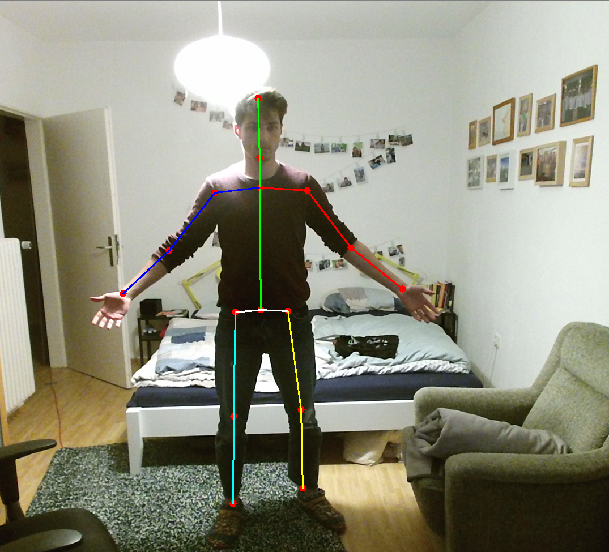
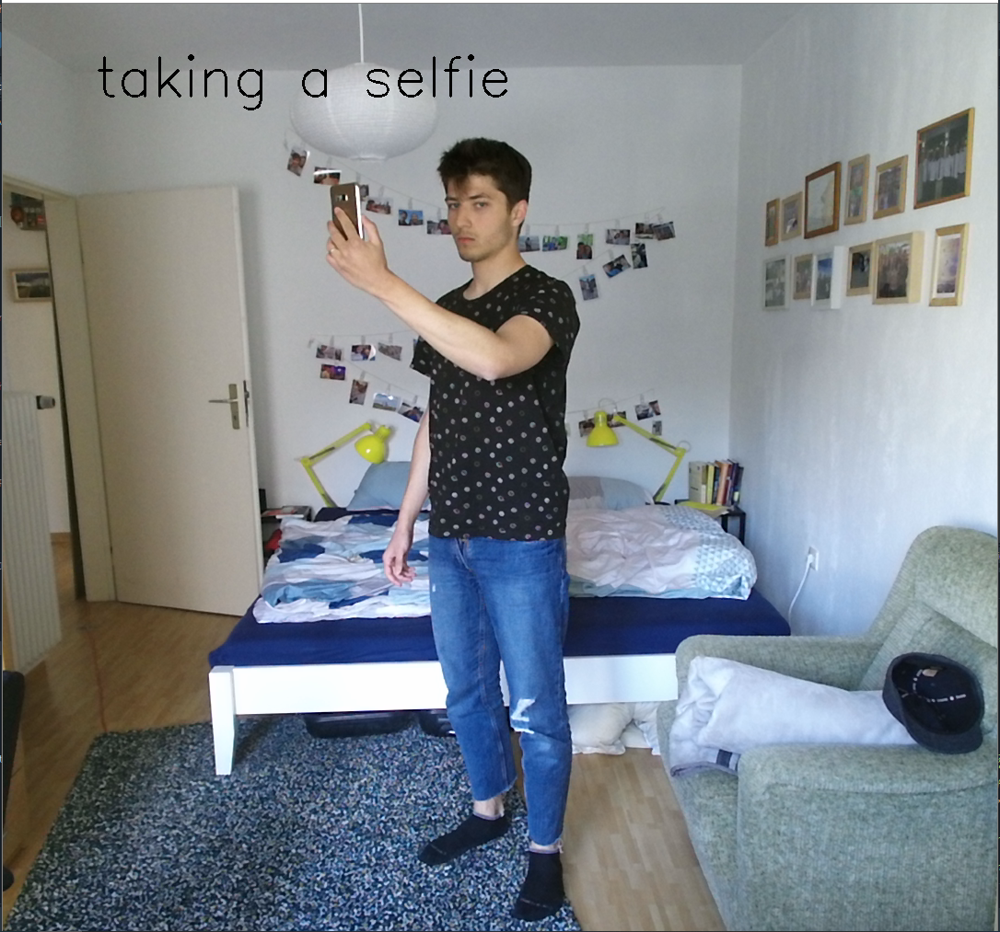

# Deep Human Action Recognition




## Limitations

Note that python3 is **required** and is used unless specified.

On Keras and on TensorFlow, only data format 'channels_last' is supported.

## Dependencies

Install required python packages before you continue:
```
  pip3 install -r requirements.txt
```

## Benset

Benset is the name of the data set I created. But the Benset directory contains all necessary functions for recording video sequences with KinectV2 cameras, the necessary preprocessing of the videos, the automatic loading of the videos for Keras training purposes and all necessary training and evaluation scripts for training the Deephar network.

### MPII

Images from MPII should be manually downloaded and placed
at `datasets/MPII/images`.

### Human3.6M

Videos from Human3.6M should be manually downloaded and placed
in `datasets/Human3.6M/S*`, e.g. S1, S2, S3, etc. for each subject.
After that, extract videos with:
```
  cd datasets/Human3.6M
  python2 vid2jpeg.py vid2jpeg.txt
```
Python2 is used here due to the dependency on cv2 package.

### PennAction

Video frames from PennAction should be manually downloaded and extracted
in `datasets/PennAction/frames`. The pose annotations and predicted bounding
boxes will be automatically downloaded by this software.

### NTU

Video frames from NTU should be also manually extracted.
A Python [script](datasets/NTU/extract-resize-videos.py) is provided to help in
this task. Python 2 is required.

Additional pose annotation is provided for NTU, which is used to train the pose
estimation part for this dataset. It is different from the original Kinect
poses, since it is a composition of 2D coordinates in RGB frames plus depth.
This additional annotation can be downloaded
[here](https://drive.google.com/open?id=1eTJPb8q2XCRK8NEC4h17p17JW2DDNwjG)
(2GB from Google Drive).


## Citing

@InProceedings{Luvizon_2018_CVPR,
  author = {Luvizon, Diogo C. and Picard, David and Tabia, Hedi},
  title = {2D/3D Pose Estimation and Action Recognition Using Multitask Deep Learning},
  booktitle = {The IEEE Conference on Computer Vision and Pattern Recognition (CVPR)},
  month = {June},
  year = {2018}
}


## License

MIT License

